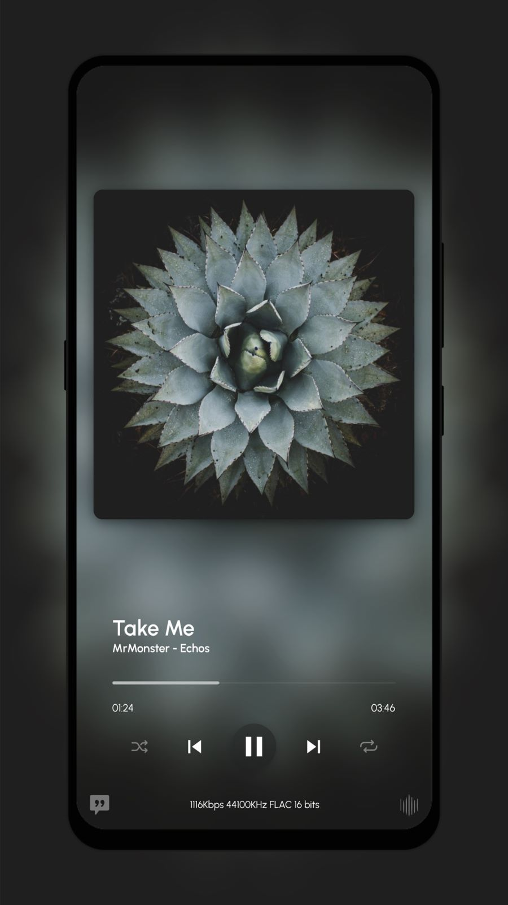

# MusicApp
A Non-Commercial Music Player Made With Flutter.

## Why MusicApp?
* Beautiful glassmorphism design
* Lyrics
* No data collected
* Cut, fade and set ringtone
* A flashlight-visualizer
* Share now-playing
* Ad-free
* Wallpapers from artwork

And a bunch more. Why not check it yourself?

## Preview
  

## TODO
* Android 11 support for deleting files
* Edit artwork
* Improve performance and stability

